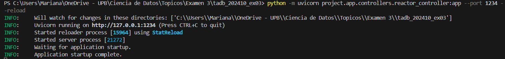
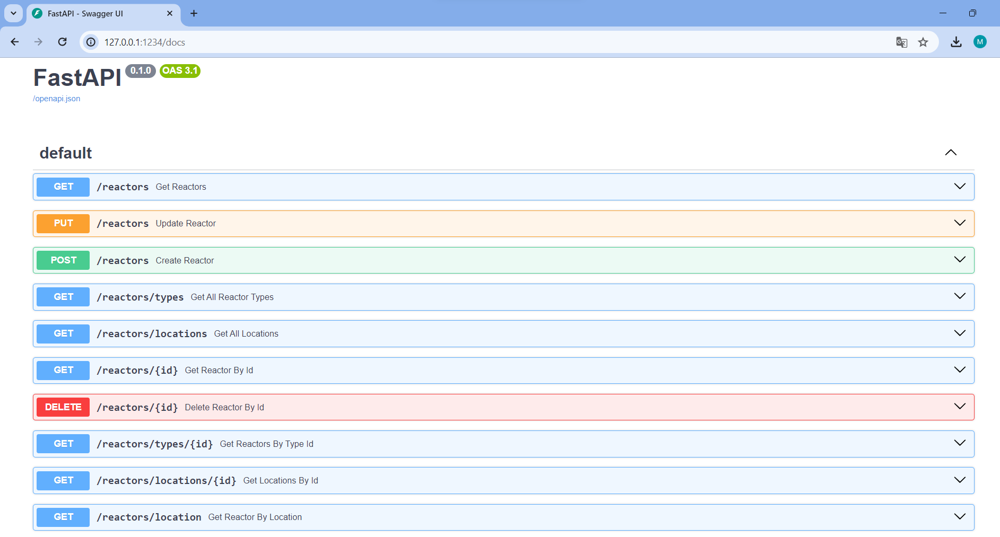

# tadb_202410_ex03

# Importante
Este proyecto se realizó utilizando el lenguaje de programación Python y el Motor de Base de datos Postgres
- Con python se utilizaron librerías como FastAPI para la creación de la API, sqlalchemy para la interacción con la base de datos de manera programática y orientada a objetos (ORM).

# Estructura de Carpetas del Proyecto

- **project/app/**
  - **context/**: Contiene la clase Session, define la configuración y la gestión del contexto de la aplicación, incluida la conexión a la base de datos.
  - **Controller/**: Contiene los controladores de la aplicación, que manejan las rutas y las solicitudes HTTP.
  - **model/**: Contiene las definiciones de los modelos de datos de la aplicación.
    - **model/reactor_schema.py**: Son los modelos con los cuales van a retornar las consultas que realice el usuario.
    - **model/reacto.py**: Es la definición del ORM para realizar el mapeo de las tablas.
  - **repositories/**: Contiene los repositorios que interactúan con la base de datos.
  - **service/**: Contiene los servicios que implementan la lógica de negocio de la aplicación.
  - **context.py**: Define la configuración y la gestión del contexto de la aplicación, incluida la conexión a la base de datos.
- **README.md**: Archivo de documentación que proporciona información sobre el proyecto, cómo configurarlo, ejecutarlo y usarlo.
- **.gitignore**: Archivo que especifica qué archivos y directorios deben ser ignorados por Git durante el versionado del proyecto.
- **.env**: Archivo que contiene variables de entorno para la configuración local del proyecto, como claves secretas, configuraciones de la base de datos, etc.

- **Sobre los Datos**
  
  - **datos/tablas.sql**: Se describe la creación de las tablas en base al diagrama en un esquema específico.
  - **datos/tabla_sin_normalizar.sql**: Es la creación de una tabla donde se importan los datos sin realizar ningun procesos de normalización, es decir, importamos el archivo "IDEA_Reactores_Nucleares_Investigacion.csv"
  - **datos/abastecimiento.sql**: Son las querys que se crearon para abastecer las tablas en el diseño relacional. 
  - **datos/IDEA_Reactores_Nucleares_Investigacion.csv**: Es la base de datos de los reactores, en esta, por facilidad y con la idea de importar la totalidad de los datos, se creó de forma manual desde el csv una columna con el id.

# Pasos para la Ejecución

Tener en cuenta la instalación de python y sus complementos

1. Crear el entorno virtual:
- instalar pipenv: pip install pipenv
- python -m pipenv shell o pipenv shell

2. Importar las siguientes librerías en el entorno virtual:
  - pip install fastapi uvicorn sqlalchemy pydantic psycopg2
  
3. Ejecutar la app:
  - python -m uvicorn project.app.controllers.reactor_controller:app --port 1234
  

  - Entrar en la dirección (local host) y agregar la extensión /docs
  

  

# Resultados
Se deja el archivo de word #Evidencias de los resultados.docx" el cual se puedes descargar y evidenciar capturas de los resultados

